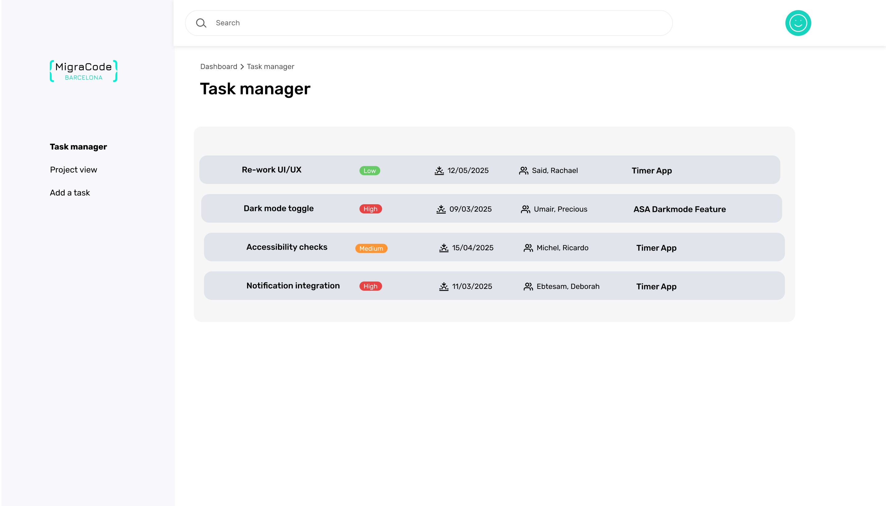

# Task Tracker Project

Hello and welcome to the Task Tracker Project!



## Get Started

To get started, please create a fork of this base repository and run the following in your terminal:

```bash
cd web
npm install
```

To start the dev server run:

`npm run dev`

Your application will start at `http://localhost:5173`.

## Fetch Updates from base repository

There is a script to fetch all updates from the base repository. Simply run

`npm run update-upstream`

## What to do?

Here you find the tasks for each week. The next weeks will be added later.

<details>
<summary>Tasks for <strong>Week 1</strong></summary>
In week 1 we focus on creating components. Please open the folder <strong>/web/src/components/domains/task</strong>. There you find two components to build. You find more details about what is expected in the components itself.
<ol>
<li>Task Item: One single task</li>
<li>TaskList: Multiple task items, each in a row, using the <TaskItem /> component
</ol>
</details>
